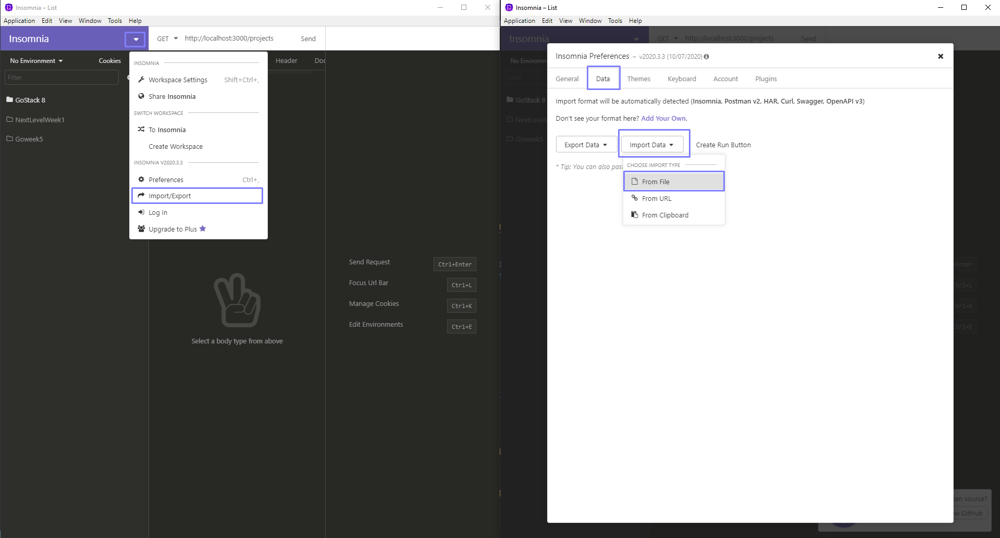

 <h5 align="center">
 </h5>

<h1 align="center">Projects and tasks 📋</h1>

<h4 align="center"></h4>

<h3 align="center">
  This is a REST API with the objective of registering your projects and their respective tasks.
</h3>

<p align="center">
  
  

  

  

  

  

</p>

<p align="center">
  <a href="#technologies">Technologies</a>&nbsp;&nbsp;&nbsp;|&nbsp;&nbsp;&nbsp;
  <a href="#structure">Structure</a>&nbsp;&nbsp;&nbsp;|&nbsp;&nbsp;&nbsp;
  <a href="#objective">Project's goal</a>&nbsp;&nbsp;&nbsp;|&nbsp;&nbsp;&nbsp;
  <a href="#how-to-use">How to Run</a>
</p>

<br />

<h2 id="techonologies" name="technologies">
🚀 Technologies
</h2>

- [Node.js](https://nodejs.org/en/) Node.js is a JavaScript interpreter, focused on migrating the client's JavaScript programming to the servers
- [Express.js](https://expressjs.com/) Framework for building REST APIs with Node.js
- [Nodemon](https://nodemon.io/) Nodemon is a utility that will monitor for any changes in your source and automatically restart your server
- [Sucrase](https://sucrase.io/) responsible for transpiling the modern code to the browser supported version

<br />

<h2 id="structure" name="structure">
🧱 Structure
</h2>

#### Requirements

- id auto increment.
- check if there is an id for the update, deletion and insertion routes of the tasks.
  ( if not, return an error )

#### Array format

```js
[
  {
    id: "1",
    title: "Novo projeto",
    tasks: ["Nova tarefa"],
  },
];
```

<br />

<h2 id="objective" name="objective">
🎯 Project's goal
</h2>

I created this API to save data in memory within a matrix, in order to put my knowledge of the concepts of javascript, nodejs, express and good code practices in practice

<br />

<h2 id="how-to-use" name="how-to-use">
▶️ How to Run
</h2>

```bash
# Clone the repository in some directory of your computer
$ git clone https://github.com/eliveltonsf/apirestful-projects-and-tasks.git

# Enter in the repository
$ cd ProjectTask

# Install the dependencies
$ yarn install

# Start the backend
$ yarn start
```

#### :gear: You can test the API

- [ ] Install Insomnia Core - <a href="https://insomnia.rest/download/"> Download </a>

- [ ] After installing, download the request structure created for insomina. <a href="https://github.com/eliveltonsf/apirestful-projects-and-tasks/blob/master/assets/Insomnia_project_task.rar?raw=true"> Insomnia_project_task.json </a>

<blockquote>
  Importing the json file into insomnia:
  <br />
load the Insomnia_project_task.json file
<br />
<br />

<br />
</blockquote>
<br />

#### :vertical_traffic_light: Routes

The server will start at port 3000, every request is sent by parameters to the back end, either by insomnia or in a web application, always taking into account the rules developed in the routes

##### List Project

<blockquote>
http://localhost:3000/projects
</blockquote>

##### Delete Project

<blockquote>
http://localhost:3000/projects/1
</blockquote>

##### Create Project

<blockquote>
http://localhost:3000/projects
</blockquote>

```json
{
  "title": "Novo projeto",
  "tasks": ["Nova tarefa"]
}
```

##### Update Project

<blockquote>
http://localhost:3000/projects/1
</blockquote>

```json
{
  "title": "Novo projeto"
}
```

##### Create task

<blockquote>
http://localhost:3000/projects/4/tasks
</blockquote>

```json
{
  "task": "new task"
}
```

<br />

<hr>

Made with 🧡 By Elivelton Ferreira. [Get in touch!](https://www.linkedin.com/in/eliveltonsf/) :calling:
